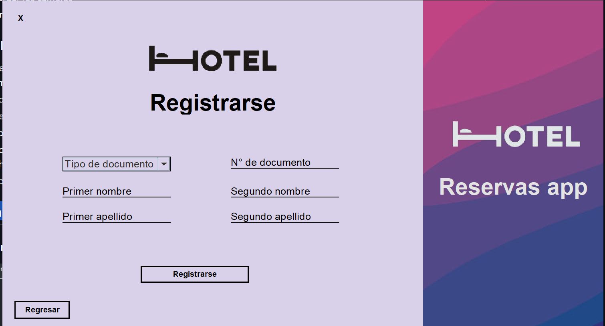
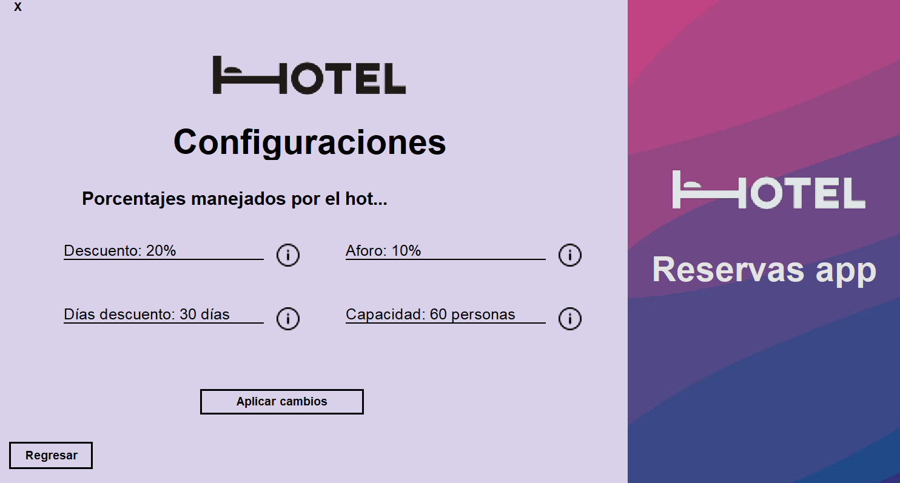

# Sistema de Reservas

El **Sistema de Reservas** es una aplicación de escritorio desarrollada en Java que permite gestionar reservas de habitaciones en un hotel. Incluye funcionalidades para registrar usuarios, realizar reservas, consultar reservas y gestionar registros de entrada y salida.

## Requisitos Previos

Antes de ejecutar el proyecto, asegúrate de cumplir con los siguientes requisitos:

-   **NetBeans**: Versión 13.
-   **PostgreSQL**: Versión 15.
-   **Driver JDBC**: `postgresql-42.6.0.jar` (incluido en el proyecto).

## Configuración Inicial

Sigue estos pasos para configurar y ejecutar el proyecto:

### 1. Verificar que PostgreSQL esté en ejecución

1. Abre el menú de Windows y busca **Servicios**.
2. Busca el servicio llamado `postgresql-x64-15`.
3. Haz clic derecho sobre el servicio y selecciona **Iniciar**.

### 2. Crear la base de datos

1. Abre **pgAdmin** o cualquier herramienta de administración de PostgreSQL.
2. Conéctate al servidor y crea una base de datos llamada `reservas`.
3. Haz clic derecho sobre la base de datos y selecciona **Query Tool**.
4. Ejecuta el script de creación de tablas.
5. Ejecuta el script de llenado de datos.

### 3. Configurar la conexión a la base de datos

1. Abre el proyecto **SistemaDeReservas** en NetBeans.
2. Navega a `src/util/ConexionBD.java`.
3. En la línea 32, reemplaza la contraseña por la que usas en tu instalación de PostgreSQL.

### 4. Configurar el driver JDBC

Si encuentras problemas con el driver JDBC:

1. Importa el archivo `postgresql-42.6.0.jar` que se encuentra en la carpeta del proyecto.
2. Asegúrate de agregarlo al classpath del proyecto en NetBeans.

### 5. Ejecutar el programa

1. En NetBeans, localiza el archivo `presentacion.controlador.Launcher`.
2. Ejecuta el archivo como el punto de entrada principal del programa.

## Funcionalidades

-   **Registro de Usuarios**: Permite registrar nuevos usuarios en el sistema.
-   **Gestión de Reservas**: Realiza, consulta y cancela reservas de habitaciones.
-   **Gestión de Registros**: Registra entradas y salidas de huéspedes.
-   **Roles de Usuario**: Acceso diferenciado para usuarios y recepcionistas.

## Visualización de la aplicación

### Registro

### Login

### Menú

### Reserva específica

### Consulta específica

### Configuraciones

